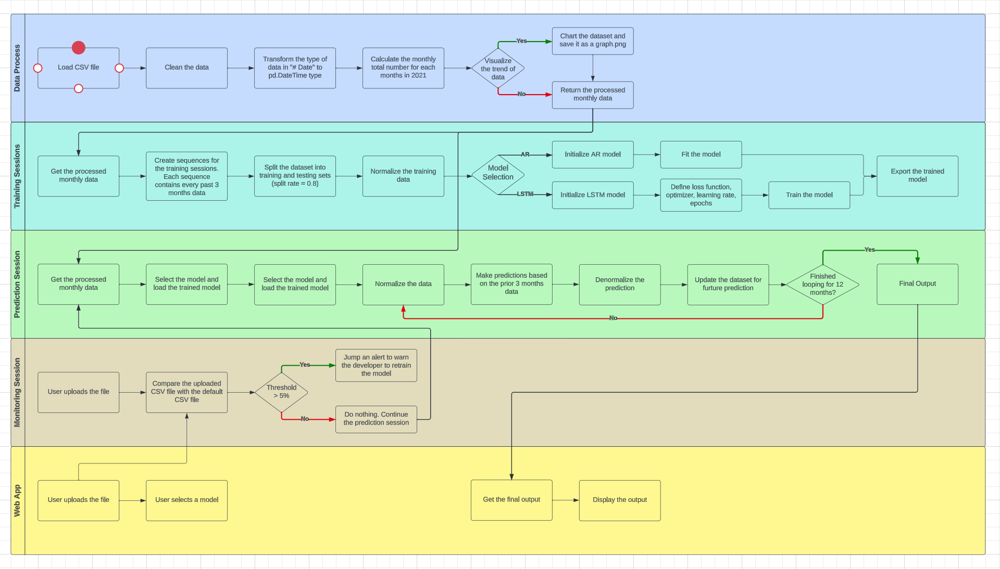

# Fetch Rewards Machine Learning Engineer Exercise
## Catalog 
- [Introduction](#introduction)
- [Models Selection](#models-selection)
- [Pipeline Design](#pipeline-design)
- [How to use?](#how-to-use)
- [What's next?](#whats-next)
- [Acknowledgement](#acknowledgement)

## Introduction
At fetch, we are monitoring the number of the scanned receipts to our app on a daily base as one of our KPIs. From business standpoint, we sometimes need to predict the possible number of the scanned receipts for a given future month.

In this project, we provide the number of the observed scanned receipts each day for the year 2021. Based on this prior knowledge, please develop an algorithm which can predict the approximate number of the scanned receipts for each month of 2022.

## Models Selection
For this project, I provided two different models to perform predictions: Autoregressive Model and LSTM model.
-   Autoregressive Model is a type of statistical model used for understanding and predicting future values in a time series. It regresses the variable against itself (its own lagged values).
-  LSTM Model is a special kind of Recurrent Neural Network (RNN), specifically designed to address the problem of long-term dependencies that traditional RNNs struggle with. The core idea behind LSTMs is the ability to retain information for long periods of time within the network's memory.

## Pipeline Design
For this project, the pipeline of processing the data, training and evaluating models, predicting the results, and monitoring the system, is designed as the following chart:


### Business Use Case Defination
Use the number of the observed scanned receipts each day for the year 2021 to predict the approximate number of the scanned receipts for each month of 2022. 

### Data Exploration
The dataset (`data_daily.csv`) contains two columns: `# Date` and `Receipt_Count`. The first one is `string` type and the second one is `int` type. To make predictions for each month of 2022, we need to aggregrate data to monthly total numbers. The dataset shows that in general, with the time pass, the numbers are increasing, as the following figure shows:


### Architecture and Algorithm Selection
For this project, since the data shows regularly increasing with the time past, we can use Autoregressive model as a ML solution, and LSTM model as a DL solution. 

### Data Pipeline and Feature Engineering
The pipeline will load the csv file and create a DataFrame type dataset, and then aggregrate the data to get monthly total numbers for each month. Also, it can convert the `# Date` to DateTime type for furture load. Then the dataset will be normalized for ease of calculation.

### Model Training
The dataset is split into training and validation set, with the split rate equals to 0.2. We use the training set to train the AR model until its converges, and train the LSTM model for 200 epochs with the learning rate equals to 0.001

### Model Evaluation
Both models shows a good training results. However, due to the small size of the dataset, the difference of model performance may not be that useful. We need to collect much more data point to continue evaluating the models.

### Model Deployment
For this project, the entire pipeline is wrapped as a API and it is deployed on a Flask web app. If you want to deploy it on the cloud, AWS and GCP can be options. I have provided the Docker image and you can deploy it on the cloud with some set-up. 

### Model Monitoring and Version Control
In this pipeline I designed a simple monitor function to monitor the data draft. If the user upload a dataset that has relative big difference with the default dataset, the pipeline will jump an alert for it, and then we need to retrain the model. However, due to the time and resources limitation, I cannot provide more monitor features. We also need to monitor the health check and model decay problems. 


## How to use?
### Run the pipeline via docker file
1. Please pull the docker image from the [docker image](https://hub.docker.com/r/jasonpeng789/fetch-ml-app) or run the following command in Terminal/Shell:
```sh
$ docker pull jasonpeng789/fetch-ml-app
```

2. I have provided the `docker-compose.yml`. Hence, please run the folloing command to initizlize the pipeline
```sh
$ docker-compose up
```

3. Connect to the website:
```
localhost:8000
```
**Note** Please note that I set the portal as **8000**. If you would like to use different portal, please modify `ports` from `docker-compose.yml`

4. Click `choose file` to upload your 2021 csv file, and then select the model you would like to have a try. The web app will use this CSV file to predict numbers for each months in 2022. Then click `Upload and Predict` to get the prediction results. 

5. Disconnect the website and stop the docker image:
```sh
$ ctrl + c
$ docker-compose down
```

### Run the pipeline on Terminal/Shell
I have provided the modified code in the `shell` folder if you would like to run the pipeline on your Terminal/Shell

1. Install the requirement pacakges
```sh
$ pip install -r requirements.txt
```

2. Go to the `shell` folder
```sh
$ cd shell
```

3. Run the `main.py`. Please note that you are required to input the following paramaters:

- -n: Represent the name of the model. Type `autoreg` to use Autoregressive model, or `lstm` to use LSTM model
- -m: Represent the mode of the pipeline. Type `train` to train the model, or `predict` to use the model to make predictions
- -p: Represent the path to the CSV file. Please use the relative path. For example, `../data_daily.csv`

Here are some example commands:
- To train an autoreg model
```sh
$ python3 main.py -n autoreg -m train -p ../data_daily.csv
```
- To use the trained autoreg model to make predictions
```sh
$ python3 main.py -n autoreg -m predict -p ../data_daily.csv
```
- To train a LSTM model
```sh
$ python3 main.py -n lstm -m train -p ../data_daily.csv
```
- To use the trained LSTM model to make predictions
```sh
$ python3 main.py -n lstm -m predict -p ../data_daily.csv
```
## What's next?
This pipeline is a simple version. If we can have more resources in the future, here is a list that we can improve the pipeline

- **Re-train the model** Currently we only have 1 year data and the dataset only contains 12 monthly total numbers. This mean the size of the training dataset is extremely small, which can affect the performance of the models. We should use much larger dataset to retrain the models.

- **Experiments with more models** Due to the time and resources limitations, I only provide two models for this pipeline. However, there are more options that may provide better solutions for this pipeline. We should do some more experiments to select the most optimal one.

- **Monitor the pipeline** For this pipeline I only implemented a monitor function to check if the user upload a dataset that has big skew with the dataset that we used to train the models. However, we should add more monitor functions to monitor the pipeline in case it crash or model decay.

- **MLOps** We should implement automatic CI/CD/CT pipeline to maintain the life cycle of the model deployment by using some cloud resouces.

- **UI/UX** I only provide a very simple web UI/UX functions for this project. If possible, we should improve the UI/UX of the web and provide better experiences for the users.

## Acknowledgement
I would like to thank Fetch Reward for providing the database used for training and testing.

